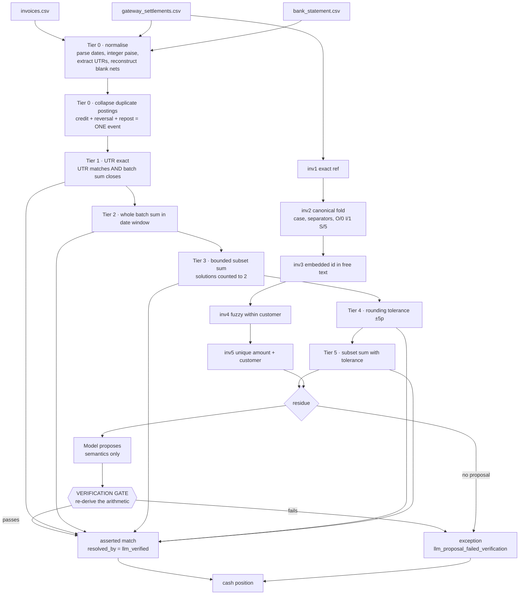

# Architecture

## The one rule

**Deterministic code decides. The model only proposes.**

No monetary match is ever asserted on the strength of a model output alone. Every match a
model suggests is re-derived arithmetically from the source data before it becomes an
assertion. If the arithmetic fails, the item is downgraded to `needs_human` — never
repaired, never retried, never quietly accepted at a lower confidence.

This is not a hedge against bad models. It is the design. The Buildathon track states
that *verification capacity, not generation speed, is the bottleneck*, and this system is
built as an argument for that claim rather than a project that merely uses an LLM.

## Pipeline

## Two levels, never conflated

Reconciliation happens at two levels with different cardinality and different failure
modes. Mixing them is a category error — "partial payment" is a property of the invoice
link, not of a bank credit.

| Level | Question | Cardinality | Failure mode | Belongs to |
|---|---|---|---|---|
| Bank ↔ batch | Which payments make up this credit? | one ↔ many | arithmetic | code |
| Payment ↔ invoice | Which invoices does this payment settle? | many ↔ many | transcription | model + fuzzy |

Ground truth is stored in two separate files for the same reason.

## Why the tiers are ordered this way

Tiers run strictly in order, and **a payment leaves the candidate pool the moment it is
consumed**, so a later, weaker tier can never re-assert money an earlier one already
attributed. Confidence decreases monotonically down the stack.

Three ordering decisions were forced by the data rather than chosen up front:

**Duplicate-posting collapse must precede Tier 1.** All three legs of a duplicate posting
(credit, reversal debit, repost credit) carry the same UTR. UTR matching first would
attribute the batch to the earliest credit and orphan the repost, which is the leg that
actually survives in the closing balance.

**Subset search must precede the tolerance tiers.** Rounding drift and withheld payments
look similar from the outside — both leave a UTR matching but the money short. Exact
subset search resolves the withheld case correctly; running tolerance first would absorb
a genuine shortfall as if it were rounding noise.

**Tolerance is only permitted where the candidate is otherwise uniquely determined.** A
±5 paise band combined with an unconstrained subset search manufactures matches, because
many subsets fall inside a loose band. The solution counter runs across the tolerance
band too, and more than one hit means ambiguous rather than matched.

## Subset search

Two choices worth defending:

**No DP over paise.** A ₹4,00,000 credit is 40,000,000 paise; a table indexed by amount is
not allocatable. Sorted-descending DFS with suffix-sum pruning runs in microseconds at the
sizes that occur — 10 to 30 candidates in a three-day window. The full seed-42 run
explores about 800 nodes in total.

**A deterministic node budget, not a wall-clock timeout.** A timeout would make the same
seed produce different headline numbers on a loaded laptop. The budget is a pure function
of the input, so the reported results are reproducible.

The search **counts solutions and stops at two**. Declaring a match ambiguous requires
*proving* a second solution exists, which is a different algorithm from finding any single
one. Three outcomes, three distinct reason codes: unique → match, two or more →
`ambiguous_multiple_subsets`, budget exhausted → `subset_search_budget_exceeded`.

Refunds and chargebacks carry negative net, which breaks the standard pruning rules and
invents combinations that cannot occur. They are folded into the target rather than
offered as free candidates: a refund only ever attaches to a batch that already contains
the payment it reverses.

## The verification gate

The gate is a pure function of `(proposal, sources)`. It imports no client — asserted
structurally by a test that parses its import graph — so it cannot be talked out of its
answer.

| Level | Checks, in order |
|---|---|
| Bank | payment set non-empty → every id exists → none already attributed → all inside the date window → **net amounts sum to the credit within tolerance** |
| Invoice | invoice set non-empty → every id exists → **every invoice belongs to the paying customer** → **payment does not exceed the invoiced total** |

The gate returns which checks ran and the arithmetic it found, not a boolean, because the
exception report has to be able to say *why*. A refused proposal keeps the model's own
reasoning next to the arithmetic that refuted it.

The same corroboration rule already operates at the deterministic layer. Transposing two
digits of an invoice number routinely produces a reference that is a *valid* invoice
belonging to a different customer. Exact string matching does not fail on those — it
succeeds, confidently, on the wrong money. Only a second independent field catches it.

## Division of labour

The model is never asked to do arithmetic; code is strictly better at summing subsets and
has already searched them exhaustively. The model gets the part code is bad at:

- reading a reference that arrives as `00423`, `INVOICE-2026-00745`, or with two digits transposed
- judging whether a narration plausibly refers to a known counterparty
- deciding that nothing fits, which is a legitimate and frequently correct answer

Structured outputs are enforced by the provider through a strict JSON schema, so a
malformed reply is impossible rather than merely discouraged. That removes a class of
parsing defensiveness and says nothing whatsoever about whether the content is right,
which is what the gate is for.

## Reproducibility

- **Data.** The generator takes `--seed` and produces byte-identical output; row order is
  sorted explicitly rather than left to dict iteration, and CSVs are written with `\n`
  line endings regardless of platform.
- **Search.** Deterministic node budgets, no wall-clock timeouts anywhere.
- **Model.** Responses are cached by SHA-256 of the exact request and the cache is
  committed. `recon match --offline` replays it, so **a judge who clones this repository
  reproduces the reported numbers with no API key and no network.** The cache is written
  after every call, so a crash on a rate-limited free tier does not cost the work already
  done.
- **Evaluation.** Ground truth is read only inside `src/recon/eval`, enforced by a test
  that scans the import graph of every other package.

## Module map

| Path | Responsibility |
|---|---|
| `src/recon/domain/` | Money as integer paise, the single fee model, data contracts, CSV IO |
| `src/recon/generator/` | Synthetic three-source data and two-level ground truth |
| `src/recon/matcher/` | Tier 0–5 bank matching, subset search, invoice matching |
| `src/recon/agent/` | Packets, model client with cache and rate limiting, **the gate** |
| `src/recon/controller/` | Cash position |
| `src/recon/eval/` | Scoring against ground truth, report rendering |
| `src/recon/pipeline.py` | Orchestration and absorption of verified proposals |
| `src/recon/cli.py` | `generate`, `match`, `evaluate`, `cash-position`, `demo` |

## What the fee model is

One function, `src/recon/domain/fees.py`, used by both the generator and the matcher — if
those two ever disagreed by a paise, the ground truth would be wrong and every reported
metric would be a lie that no test could see.

Rounding uses `Decimal` with `ROUND_HALF_UP`, not Python's `round()`, which is banker's
rounding: `round(0.5) == 0`. On a 25-paise transaction, 2% is exactly half a paise, and
the two conventions disagree. A test pins that case specifically.
